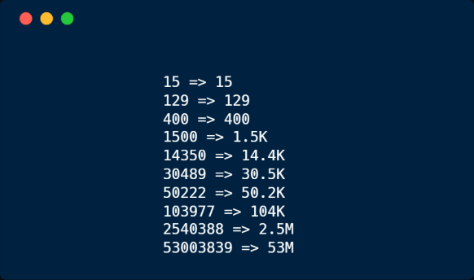

# js-abbreviation-number &middot;  [](https://github.com/moh3n9595/js-abbreviation-number/blob/master/LICENSE) [](https://github.com/moh3n9595/js-abbreviation-number/compare) [](https://codecov.io/gh/moh3n9595/js-abbreviation-number)


<p align="center">
    
  <br>
  <p align="center">
    Abbreviate numbers in javascript
  </p>
</p>

## Installation

```
npm install js-abbreviation-number
```

## Usage

```

import { abbreviateNumber } from "js-abbreviation-number";

const num = abbreviateNumber(1000, 1); // expected 1.0K

const num = abbreviateNumber(12, 0); // expected 12

const num = abbreviateNumber(1111, 2); // expected 1.11K

const num = abbreviateNumber(1234.56, 1); // expected 1.2K

```
`abbreviateNumber(num: number, digit?: number, symbols?: Array<string>): string`

The `symbols` is optional. It can be an array of units, defaulting to `["", "K", "M", "G", "T", "P", "E"]`.

`digit` is also optional. It defaults to 1.

## Contributing

Thank you for your interest in contributing! Please feel free to put up a PR for any issue or feature request.

## Give me a Star

If you think this project is helpful just give me a ⭐️ Star is enough because i don't drink coffee 😃

## License

This project is licensed under the MIT License - see the [LICENSE.md](https://github.com/moh3n9595/js-abbreviation-number/blob/master/LICENSE) file for details

## Author

Made with ❤️ by [Mohsen Madani](https://github.com/moh3n9595).

